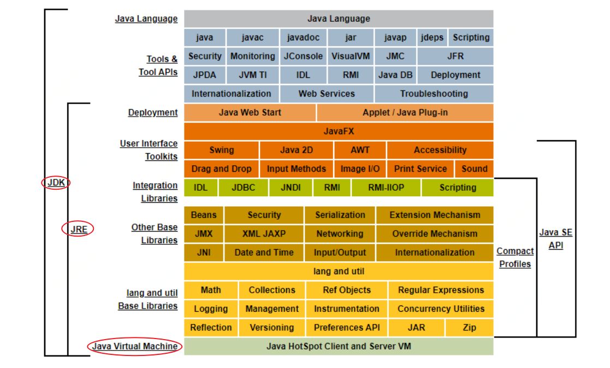
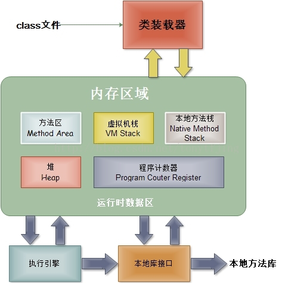
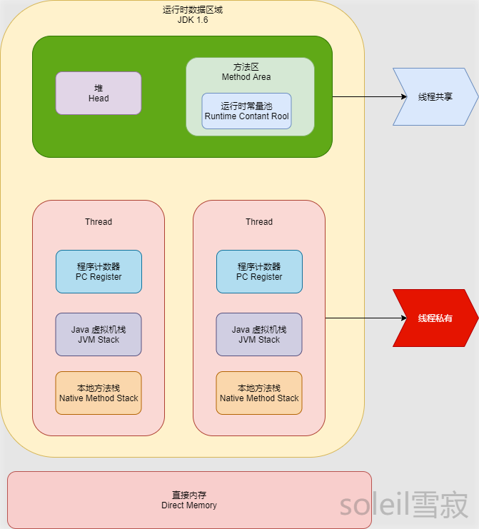
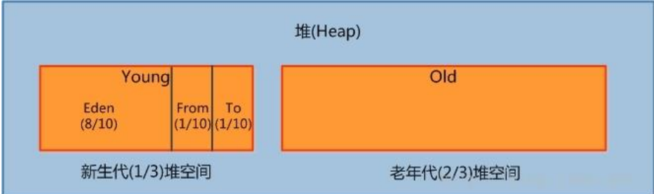
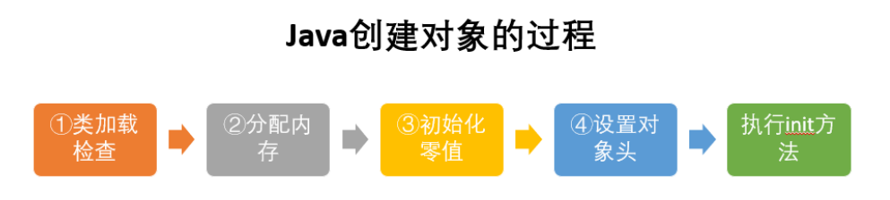
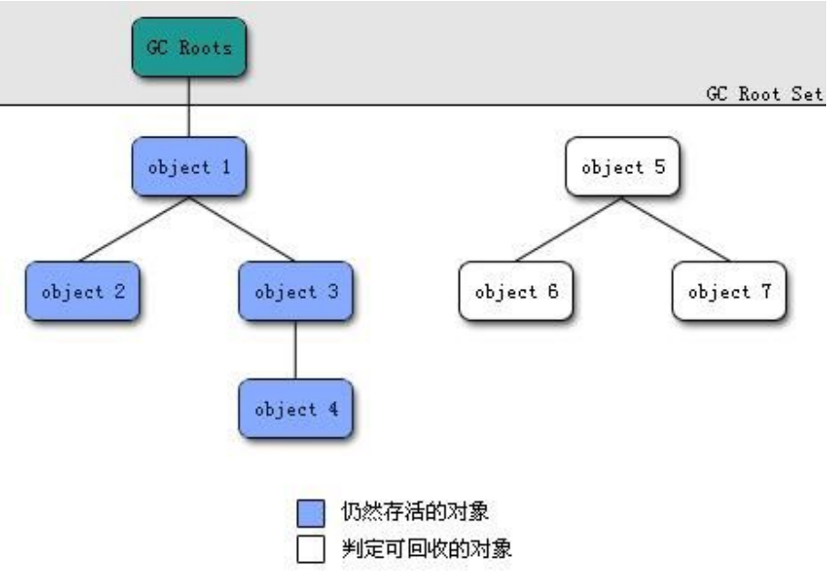
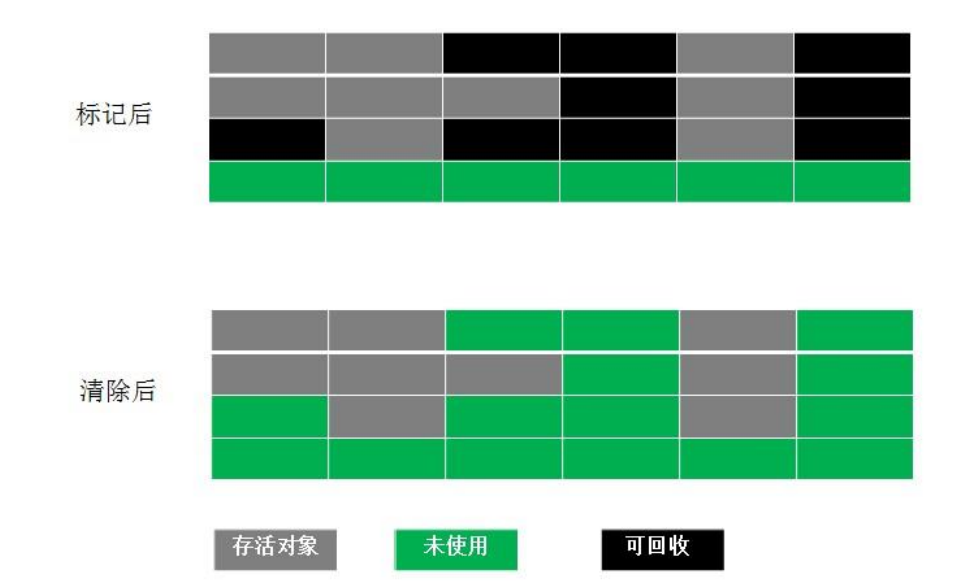
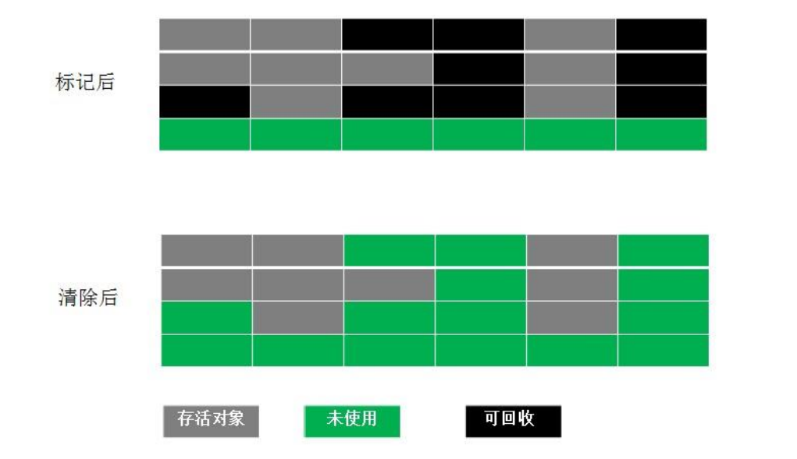
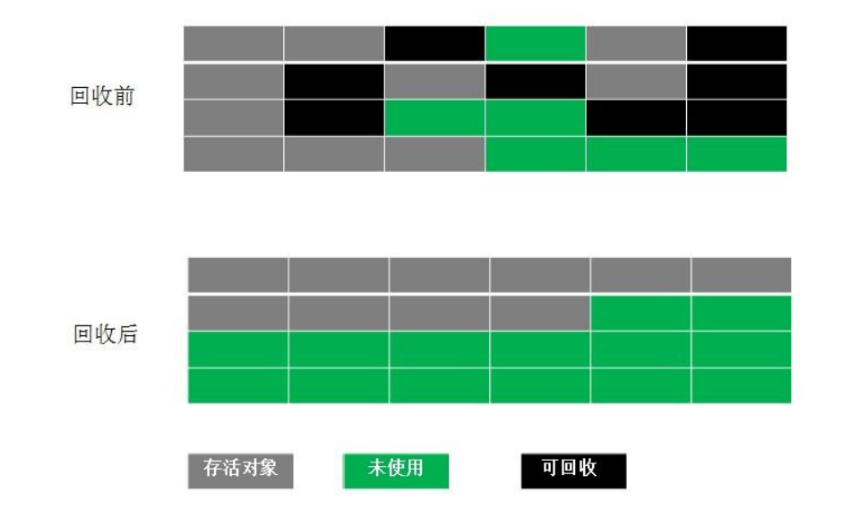

[TOC]

## 1、什么是JVM

### 1.1 JVM释义

JVM是一种用于计算设备的规范，它是一个虚构出来的计算机，是通过在实际的计算机上仿真模拟各种计算机功能来实现的。Java虚拟机包括一套字节码指令集、一组寄存器、一个栈、一个垃圾回收堆和一个存储方法域。 JVM屏蔽了与具体操作系统平台相关的信息，使Java程序只需生成在Java虚拟机上运行的目标代码（字节码）,就可以在多种平台上不加修改地运行。JVM在执行字节码时，实际上最终还是把字节码解释成具体平台上的机器指令执行。

JVM是JRE的一部分。它是一个虚构出来的计算机，是通过在实际的计算机上仿真模拟各种计算机功能来实现的。JVM有自己完善的硬件架构，如处理器、堆栈、寄存器等，还具有相应的指令系统。Java语言最重要的特点就是跨平台运行。使用JVM就是为了支持与操作系统无关，实现跨平台。

> ***Y---：JVM是一个运行在另一个操作系统上的程序，它的内部模拟了一个操作系统，通过这种模式来打通各个平台的底层，让所有能运行JVM的系统上都能运行JAVA代码。***

### 1.2 JVM、JDK和JRE比较

**JVM**：Java Virtual Machine（java虚拟机）,一种能够运行字节码的虚拟机，将字节码解释成不同os下的机器指令，有了jvm，java语言在不同平台上运行时不需要重新编译，即平台无关性。

JDK：Java Development Kit，Java语言的软件开发工具包（SDK），物理存在，是Programming tools、JRE和JVM的集合；

JRE：Java Runtime Environment，Java运行时环境，物理存在，主要由Java API和JVM组成，提供了用于执行Java程序的最低要求的环境。

## 2、JVM的构成

- 类加载器（ClassLoader）：虚拟机设计团队把类加载阶段中的“通过一个类的全限定名来获取描述此类的二进制字节流”这个动作放到Java虚拟机外部去实现，以便让应用程序自己决定如何去获取所需要的类。实现这个动作的代码模块称为类加载器；
- 运行时数据区（Runtime Data Area）：实在JVM运行的时候操作所分配的内存区；
- 执行引擎（Execution Engine）：负责执行class文件中包含的字节码指令；
- 本地库接口（Native Interface）：主要是调用C或C++实现本地方法及返回结果。

> JVM作为一个虚拟的类似于计算机首先有一个基本构成，也就是相当于计算机的硬件，分为类加载器，运行时数据区，执行引擎和本地接口库，然后再这个基础上，运行起来时以后的内存区域都是在运行时数据区中的，所以这样就很好理解JVM的整体架构了。

## 3、JVM运行时数据区

### 3.1 JVM运行时数据区构成

- 方法区（Method Area）：用于存储类结构信息的地方、包括常量池、静态变量、构造函数等。
- Java堆（Heap）：存储Java实例或者对象的地方。这块是GC的主要区域。
- Java栈（Stack）：Java栈总是和线程关联在一起的，每当创建一个线程时，JVM就会为这个线程创建一个对应的Java栈。在这个Java栈中又会包含多个栈帧，每运行一个方法就会创建一个栈帧，用于存储局部变量表、操作栈、方法返回值等。每一个方法从调用直至执行完成的过程，就对应一个栈帧在Java栈中入栈到出栈的过程。所以Java栈时线程私有的。
- 程序计数器（PC Register）：用于保存当前线程执行的内存地址。由于JVM程序时多线程执行的（线程轮流切换），所以为了保证线程切换回来后还能恢复到原先状态，就需要一个独立的计数器，记录之前中断的地方，可见程序计数器也是线程私有的。
- 本地方法栈（Native Method Stack）：和Java栈的作用差不多，只不过是为JVM使用到native方法服务的。

JDK1.6和JDK1.8有些许不同

### 3.2 Java虚拟机堆（Heap）

几乎所有对象都在这里分配内存，存放对象实例，是垃圾收集的主要区域（“GC堆”）。但是，对着JIT编译器的发展与逃逸分析技术的逐渐成熟，栈上分配、标量替换优化技术将会导致一些微妙的变化。从JDK1.7开始已经默认开启逃逸分析，如果某些方法中的对象引用没有被返回或者未被外面使用（也就是未逃逸出去），那么对象可以直接在栈上分配内存。

堆最容易出现的就是OutOfMemoryError错误：

- OutOfMemoryError：GC Overhead Limit Exceeded：当JVM花太多时间执行垃圾回收并且只能回收很少的堆空间时，就会发生此错误；
- java.lang.OutOfMemoryError:Java Heap Space:假如在创建新的对象时，堆内存中的空间不足以存放新创建的对象，就会引发`java.lang.OutOfMemory:Java heap space`错误。（和本机物理内存无关，和你配置的内存大小有关）。

从垃圾回收的角度看：

- Java堆，由年轻代和老年代组成，分别占据1/3和2/3；
- 而年轻代又分为三部分：Eden、From Survivor和To Survivor，占比为8:1:1，可调。

⚠️注意：这些区域划分仅仅是一部分垃圾收集器的共同特性或者说设计风格而已，而非某个Java虚拟机具体实现的固有布局，HotSpot里面已经出现了不采用分代设计的新垃圾收集器。

### 3.3 Java虚拟机栈（Stack）

生命周期和线程相同，描述的是Java方法执行的内存模型，每次方法调用的数据都是通过栈传递的。

每个Java方法在执行的同时会创建一个栈帧用于存储***局部变量表***、***操作数栈***、***常量池引用***等信息。从方法调用直至执行完成的过程，对应着一个栈帧在Java虚拟机入栈和出栈的过程。

可能出现的两种错误：StackOverFlowError和OutOfMemoryError

- StackOverFlowError：若Java虚拟机的内存大小不允许动态扩展，那么当线程请求栈的深度超过当前Java虚拟机栈的最大深度的时候，就会抛出StackOverFlowError错误；
- OutOfMemoryError：若Java虚拟机堆中没有空闲内存，并且垃圾回收器也无法提供更多内存的话，就会抛出OutOfMemoryError错误。

### 3.4 本地方法栈（Native Method Stack）

和虚拟机栈所发挥的作用非常相似，只是本地方法栈使用到的是Native方法。

本地方法被执行的时候，在本地方法栈也会创建一个栈帧，用于存放改本地方法的局部变量表、操作数栈、动态链接、出口信息。

同样会出现两种错误：StackOverFlowError和OutOfMemoryError。

### 3.5 方法区（Method Area）（JDK1.8已移除）

存储已被虚拟机加载的类信息、常量、静态变量、即时编译器编译后的代码缓存等数据。虽然Java虚拟机规范把方法区描述为堆的一个逻辑部分，但是它却有一个别名叫做Non-Heap（非堆），目的应该是与Java堆区分开来，方法区也被称作为永久代。

方法区包含了一个运行时常量池（Runtime Constant Pool），在JDK1.8已经被移到了元空间；

注意：

- JDK6，HotSpot开发团队就有放弃永久代，逐步改为采用本地内存（Native Memory）来实现方法区的计划了；
- JDK7，已经把原本放在永久代的字符串常量池、静态变量等移出；
- JDK8，终于完全废弃了永久代的概念，该用JRockit、J9一样在本地内存中实现元空间（Meta-space）来代替，把JDK7中永久代还剩余的内容（主要是类型信息）全部移到元空间中。

Java方法有两种返回方式：

- return语句；
- 抛出异常。

### 3.6 程序计数器（PC Register）

当前线程所执行的字节码的行号指示器。

程序计数器是唯一一个不会抛出OutOfMemoryError的内存区域，它的生命周期随着线程的创建而创建，随着线程的结束而死亡。

### 3.7 直接内存（Direct Memory）

并不是虚拟机运行时数据的一部分，也不是《Java虚拟机规范》中定义的内存区域，但是这部分也会被频繁使用，而且也可能导致OurOfMemoryError异常出现。

元空间从虚拟机Java堆中转移到本地内存，默认情况下，元空间的大小仅受本地内存的限制。

## 4、类加载器

### 4.1 类加载器介绍

负责加载.class文件，将class文件字节码内容加载到内存中，并将这些内容转换成方法区中的运行时数据结构，并且ClassLoader只负责class文件的加载，而是否能运行则由Execution Engine来决定。

#### 4.1.1 JDK默认提供三种ClassLoader：

1、启动类加载器BootStrap ClassLoader：加载are/lib/rt.jar;

2、扩展类加载器Extension ClassLoader：加载jre/lib/ext*.jar;

3、应用程序类加载器Application ClassLoader：加载classpath上指定的类库。

#### 4.1.2 三种类加载器的关系

1、BootStrap ClassLoader是在Java虚拟机启动后初始化的；

2、BootStrap ClassLoader负责加载ExtClassLoader，并且将ExtClassLoader的父加载器设置为BootStrap ClassLoader；

3、BootStrap ClassLoader加载完ExtClassLoader后，就会加载AppClassLoader，并且将AppClassLoader的父加载器指定为ExtClassLoader。

类加载器的作用

| Class Loader            | 实现 | 负责加载                                                     |
| ----------------------- | ---- | ------------------------------------------------------------ |
| Bootstrap Loader        | C++  | `%JAVA_HOME%/jre/lib`, `%JAVA_HOME%/jre/classes`以及-Xbootclasspath参数指定的路径以及中的类 |
| Extension ClassLoader   | Java | `%JAVA_HOME%/jre/lib/ext`，路径下的所有`classes`目录以及`java.ext.dirs`系统变量指定的路径中类库 |
| Application ClassLoader | Java | `Classpath`所指定的位置的类或者是`jar`文档，它也是`Java`程序默认的类加载器 |

在Application下边是自定义ClassLoader；

### 4.2 ClassLoader隔离

每一个类加载器都有一个自己的命名空间来保存已加载的类。当一个类加载器加载一个类时，它会通过保存在命名空间里的类全局限定名（Fully Qualified Class Name）进行搜索来检测这个类是否已经被加载了。

JVM及Dalvik对类唯一的识别是ClassLoader id + PackageName + ClassName，所以一个运行程序中是有可能存在两个包名和类名完全一致的类的。并且如果这两个“类”不是由一个ClassLoader加载，是无法将一个类的实例强转为另外一个类的，这就是ClassLoader隔离。

双亲委托机制是ClassLoader类一致问题的一种解决方案，也是Android插件化开发和热修复的基础。

### 4.3 双亲委托机制

当一个类加载器收到一个类加载请求时，该类加载器首先会把请求委派给父类加载器。每个类加载器都是如此，只有在父类加载器在自己的搜索范围内找不到指定类时，子类加载器才会尝试自己去加载。

#### 具体流程：

1、当Application ClassLoader收到一个类加载请求时，他首先不会自己去尝试加载这个类，而是将这请求委派给父类加载器Extension ClassLoader去完成；

2、当Extension ClassLoader收到一个类加载请求时，他首先也不会自己去尝试加载这个类，而是将请求委派给父类加载器Bootstrap ClassLoader去完成；

3、如果Bootstrap ClassLoader加载失败（在<JAVA_HOME>\lib中未找到所需类），就会让Extension ClassLoader尝试加载；

4、如果Extension ClassLoader也加载失败，就会使用Application ClassLoader加载；

5、如果Application ClassLoader也加载失败，就会使用自定义加载器去尝试加载；

6、如果均加载失败，就会抛出ClassNotFoundException异常。

#### 优点

Java类随着它的类加载器一起具备了一种带有优先级的层次关系。例如类Object，它放在rt.jar中，无论哪一个类加载器要加载这个类，最终都是委派给启动类加载器进行加载，因此Object类在程序的各种类加载器环境中都是同一个类。（判断两个类是否相同是通过classloader.class这种方式进行的，所以哪怕是同一个class文件如果被两个classloader加载，那么他们也是不同的类）。

### 4.4 自定义类加载器

## 5、JVM类加载过程

### 5.1类加载机制

JVM类加载机制就是把描述类的数据从class文件加载到内存，并对数据进行校验、转换解析和初始化，最终形成可以被虚拟机直接使用的Java类型。在Java语言里，类型的加载、连接和初始化都是在程序运行期间完成的。

分为以下三种：

- 1、全盘负责，当一个类加载器负责加载某个Class时，该Class所依赖的和引用的其他Class也将由该类机载器负责载入，除非显示使用另外一个类加载器来载入；
- 2、父类委托，让父类加载器试图加载该类，只有在父类加载器无法加载该类时，才尝试从自己的类路径中加载该类；
- 缓存机制，缓存机制将会保证所有加载过的Class都会被缓存，当程序中需要使用某个Class时，类加载器会先从缓存区寻找该Class，只有缓存区不存在，系统才会读取该类对应的二进制数据，将其转换成Class对象，存入缓存区。这就是为什么修改了Class后，必须重启JVM，程序的修改才会生效。

### 5.2 类加载器的执行流程

从类被加载到虚拟机内存中开始，到释放内存总共有7个步骤：

加载，验证，准备，解析，初始化，使用，卸载。

其中，验证、准备、解析三个部分统称为连接。

#### 5.2.1 加载（Loading）

加载是类加载的一个阶段，不要混淆。

加载过程完成以下三件事：

- 1、通过类的完全限定名称获取定义该类的二进制字节流；
- 2、将该字节流表示的静态存储结构转换为方法区的运行时存储结构；
- 3、在堆中生成一个代表这个类的java.lang.Class对象作为方法区中该类数据访问的入口。

其中二进制字节流可以从以下方式中获取：

- 1、从ZIP包读取，成为JAR、EAR、WAR格式的基础；
- 2、从网络中获取，最经典的应用是Applet；
- 3、运行时计算生成，例如动态代理技术，在java.lang.reflect.Proxy使用ProxyGenerator.generateProxyClass的代理类的二进制字节流；
- 4、由其他文件生成，例如由JSP文件生成对应的Class类。

#### 5.2.2 链接（Linking）

- 1、验证（Verifying）：确保类加载符合JVM规范和安全，保证被校验类的方法在运行时不会做出危害虚拟机的事件，其实就是一个安全检查；

- 2、准备（Preparing）：为static变量在方法区中分配内存空间，设置变量的初始值，例如static int a = 3；

  （⚠️注意：准备阶段只设置类中的静态变量（方法区中），不包括实例变量（堆内存中），实例变量是对象初始化时赋值的）

- 3、解析（Optionally resolving）：虚拟机将常量池内的符号引用替换为直接引用的过程。

  （符号引用指比如import java.util.ArrayList这就算符号引用，直接引用就是指针或者对象地址，注意引用对象一定是在内存进行。）

#### 5.2.3 初始化（Initialization）

初始化其实就是一个赋值的操作，它会执行一个类构造器的`<clinit>()`方法。由编译器自动收集类中所有变量的赋值动作，此时准备阶段时的那个static int a = 3的例子，在这个时候就正式赋值为3；

#### 5.2.4 卸载（Delete）

GC将无用对象从内存中卸载。

## 6、对象创建

### 6.1 对象的创建

Java对象创建的大概过程如下：

#### 6.1.1 类加载检查

虚拟机遇到一条new指令时，首先将去检查这个指令的参数是否能在常量池中定位到这个类的符号引用，并且检查这个符号引用代表的类是否已被加载、解析和初始化过。如果没有，那必须先执行相应的加载过程。

#### 6.1.2 分配内存

在类加载检查通过后，接下来虚拟机将为新生对象分配内存。对象所需的内存大小在类加载完成后便可确定，为对象分配空间的任务等同于把一块去定大小的内存从Java堆中划分出来。

> 内存分配的方式有“指针碰撞”和“空闲列表”两种：选择哪种方式取决于Java堆内存是否规整。而Java堆内存是否规整，取决于GC收集器的算法时“标记-清除”，还是“标记-整理”（也称作“标记-压缩”），值得注意的是，复制算法内存也是规整的。

#### 6.1.3 初始化零值

内存分配完成后，虚拟机需要将分配到的内存空间都初始化为零值（不包括对象头），这一步操作保证了对象的实字段在Java代码中可以不赋初始值就可以直接使用，程序能访问到这些字段的数据类型所对应的零值。

#### 6.1.4 设置头对象

初始化零值完成后，虚拟机要对对象进行必要的设置，例如这个对象时那个类的实例、如何才能找到类的元数据信息、对象的哈希码、对象的GC分代年龄等信息。这些信息存放在对象头中。另外，根据虚拟机当前运行状态不同，如是否启用偏向锁等，对象头会有不同的设置方式。

#### 6.1.5 执行init方法

在上面的工作都完成之后，从虚拟机的视角来看，一个新的对象已经产生了，但从Java程序的视角来看，对象创建才刚刚开始，方法还没有执行，所有的字段都还为零。所以一般来说，执行new指令之后会接着执行方法，把对象按照程序员的意愿进行初始化，这样一个真正可用的对象才算是完全产生出来。

### 6.2 对象的内存布局

在HotSpot虚拟机里，对象在堆内存中的存储布局可以划分为三个部分：对象头（Header）、实例数据（Instance Data）和对齐填充（Padding）；

存储对象自身的运行时数据，如哈希码（HashCode）、GC分代年龄、锁状态标志、线程持有锁、偏向线程ID、偏向时间戳等，这部分数据的长度在32位和64位的虚拟机（未开启压缩指针）中分别为32个比特和64个比特，官方称之为“Mark Word”。

### 6.3 对象的访问定位

建立对象就是为了使用对象，Java程序通过栈上的Reference数据来操作堆上的具体对象。对象的访问方式由虚拟机实现而定，目前主流的访问方式有两种：使用句柄，直接指针；

- 句柄：Java堆回划分出一块内存用来作为句柄池，Reference中存储的就是对象的句柄地址，而句柄中包含了对象实例数据与类型数据各自的具体地址信息；

  

- 直接指针：Java堆对象的布局中就必须考虑如何放置访问类型数据的相关信息，而reference中存储的直接就是对象的地址。

  

## 7、GC垃圾回收机制

对于垃圾回收，主要考虑三件事：

- 1、哪些内存需要回收；
- 2、什么时候回收；
- 3、如何回收。

### 7.1 垃圾检测

#### 7.1.1 引用计数法（Reference Counting）

引用计数算法：

- 在对象中添加一个引用计数器，每当有一个地方引用它时，计数器就加一；
- 当引用失效时，计数器就减一；
- 任何时刻计数器为零的对象就是不可能再被使用的。

> 客观的说，引用计数法（Reference Counting）虽然占用了一些额外的内存空间进行计数，但它的原理简单，判定效率也高，在大多数情况下它都是一个不错的算法。但是Java领域，至少主流的Java虚拟机里面都没有选用引用计数法来管理内存，主要原因是，这个看似简单的算法有很多例外情况要考虑，例如在处理一些相互依赖、循环引用的时候非常复杂。

#### 7.1.2 可达性分析算法（Reachability Analysis）

当前主流的商用程序语言的内存管理子系统，都是通过可达性分析（Reachability Analysis）算法来判定对象是否存活的。这个算法的基本思路就是通过一系列成为“GC Roots”的根对象作为起始节奏点集，从这些节点开始，根据索引用关系向下搜索，搜索过程所走的路径称为“引用链”（Reference Chain），如果某个对象到GC Roots间没有任何引用链相连，或者用图论的话来说就是从GC Roots到这个对象不可达时，则证明此对象是不可能再被使用的。

GC Roots包括：

- 全局性引用，对方法区的静态对象、常量对象的引用；
- 执行上下文，对Java方法栈帧中的局部对象引用、对JNI handles对象引用；
- 已启动且未停止的Java线程。

#### 7.1.3 引用

无论通过技术法还是可达性分析法，判定对象是否存活都和“引用”离不开关系。

Java的引用分为四种：强引用（Strongly Reference）、软引用（Soft Reference）、弱引用（Weak Reference）和虚引用（Phantom Reference）；

- 强引用时最传统的“引用”定义，是指在程序代码之中普遍存在的引用赋值，即类似“`Object object = new Object（）`”这种引用关系。无论在任何情况下，只要引用关系还在，垃圾收集器就永远不会回收掉被引用的对象；
- 软引用是用来描述一些还有用，但非必需的对象。植被引用关联着的对象，在系统将要发生内存溢出异常前，会把这些对象列进回收范围之中进行二次回收，如果这次回收内存还没有足够的内存，才会抛出内存溢出异常。Java提供了SoftReference来实现软引用；
- 弱引用也是用来描述那些非必需对象，但是它的强度比软引用更弱一些，被弱引用关联的对象只能生存到下一次垃圾收集发生为止。当垃圾收集器开始工作，无论当前内存是否足够，都会回收掉只被弱引用关联的对象。Java提供了WeakReference类来实现弱引用；
- 虚引用也称为“幽灵引用”或者“幻影引用”，它是最弱的一种引用关系。一个对象是否有虚引用的存在，完全不会对其生存时间构成影响，也无法通过虚引用来取得一个对象实例。为一个对象设置虚引用关联的唯一目的只是为了能在这个对象被收集器回收时收到一个系统通知。Java提供了PhantomReference类来实现虚引用。

### 7.2 垃圾收集算法

#### 7.2.1 标记-清除算法

最早出现也是最基础的垃圾收集算法“标记-清除”（Mark-Sweep）算法。后续的收集算法大多都是以此为基础改进的。

分为“标记”和“清除”两个阶段：首先标记出所有需要回收的对象，在标记完成后，统一回收掉所有被标记的对象，也可以反过来标记存活对象，统一回收未被标记的对象。标记过程就是对象是否属于垃圾的判定过程。

它主要有两个缺点：

- 执行效率不稳定。

  如果Java堆中包含大量对象，而且其中大部分是需要被回收的，就必须进行大量的标记和清除动作，导致两个过程执行效率都随对象数量的增长而降低；

- 内存空间碎片化。

  标记-清除之后会产生大量不连续的内存碎片，空间碎片太多可能会导致以后在程序运行过程中需要分配较大对象时无法找到足够的连续内存而不得不提前触发另一次垃圾收集动作。

#### 7.2.2 标记-复制算法

标记-复制算法常被简称为复制算法。为了解决标记-清除算法面对大量可回收对象时执行效率低的问题。

它将可用内存按照容量划分为大小相等的两块，每次只使用其中一块。当这一块的内存用完了，就将还存活着的对象复制到另外一块上面，然后再把已使用过的内存空间一次清理掉。

优点：实现简单，效率高；

缺点：空间浪费较多。

#### 7.2.3 标记-整理算法

标记-整理算法的标记过程仍然与“标记-清除”算法一样，但后续步骤不是直接堆可回收对象进行清理，而是让所有存活对象都像内存空间一端移动，然后直接清理掉边界以外的内存。

#### 7.2.4 分代收集理论

当前商业虚拟机的垃圾回收集器，大多遵循了“分代收集”（Generational Collection）的理论进行设计，分代收集名为理论，实质是一套符合大多数程序运行实际情况的经验法则，它建立在两个假说之上：

- 1、弱分代假说（Weak Generational Hypothesis）：绝大多数对象都是朝生夕灭的；
- 2、强分代假说（Strong Generational Hypothesis）：熬过越多次垃圾收集过程的对象就越难消亡。

基于这两个假说，收集器将Java堆划分出不同的区域，然后回收对象依据年龄（年龄即为对象熬过垃圾收集过程的次数）分配到不同的区域之中存储。

设计者一般至少会把Java堆划分为新生代（Young Generation）和老年代（Old Generation）两个区域，在新生代中每次垃圾收集时都发现有大批对象死去，而每次回收后存活的少量对象，将会逐步晋升到老年代中存放。

基于这种分代，老年代和新生代具备不同的特点，可以采用不同的垃圾回收算法：

- 新生代中每次收集都会有大量对象死去，可以选择标记-复制算法，只需要付出少量对象的复制成本就可以完成每次的垃圾收集；
- 老年代中对象存活几率高，而且没有额外空间对他进行分配担保，所以必须选择标记-清除或标记整理算法进行垃圾收集。

> 因为有了分代收集理论，所以就有了“Minor GC（新生代GC）”、“Major GC（老年代GC）”、“Full GC（全局GC）”这样的回收类型的划分，但一般只有Monor GC和Full GC。
>
> - Minor GC：回收新生代，新生代存活时间短，Minor GC会频繁执行，一般执行速度比较快；
> - Full GC：回收老年代和新生代，老年代对象存活时间长，因此Full GC很少执行，速度会慢很多。
>
> Full GC触发条件：
>
> - 调用System.gc();
> - 老年代空间不足；
> - 空间分配担保失败；
> - JDK1.7以前的永久代空间不足；
> - Concurrent Mode Failure：CMS GC的过程中同时有对象要放入老年代，而此时老年代空间不足。

### 7.3 内存分配策略

- 对象优先在Eden 分配；

- 大对象直接进入老年代；

- 长期存活的对象进入老年代；

- 动态对象年龄判定：

  虚拟机并不是永远要求对象的年龄必须达到MaxTenuringThreshold才能晋升老年代，如果是在Survivor中相同年龄所有对象大小的总和大于Survivor空间的一半，则年龄大雨或等于该年龄的对象可以直接进入老年代，无需等到MaxTenuringThreshold中要求的年龄。

- 空间分配担保：

  在发生Minor GC之前，虚拟机先检查老年代最大可用的连续空间是否大于新生代所有对象总空间，如果是，Minor GC可以确认是安全的，如果不是，虚拟机会查看HandlePromotionFailure的值是否允许担保失败，如果允许那么就会继续检查老年代最大可用连续空间是否大于历次晋升到老年代对象的平均大小，如果大于，将尝试着进行一次Minor GC；如果小于，或者HandlePromotionFailure的值不允许冒险，那么就要进行一次Full GC。

### 7.4 垃圾收集器

| 收集器                   | 简介                                                         |
| ------------------------ | ------------------------------------------------------------ |
| Serial 收集器            | 串行、单线程                                                 |
| ParNew 收集器            | Serial 收集器的多线程、新生代收集器                          |
| Parallel Scavenge 收集器 | 多线程收集器、吞吐量优先                                     |
| Serial Old 收集器        | Serial 收集器的老年代版本、                                  |
| Parallel Old 收集器      | Parallel Scavenge 收集器的老年代版本、在注重吞吐量以及 CPU 资源敏感的场合，都可以优先考虑 Parallel Scavenge 加 Parallel Old 收集器。 |
| CMS 收集器               | 标记 - 清除算法、流程（初始标记、并发标记、重新标记、并发清除） |
| G1 收集器                | 面向服务端应用的垃圾收集器，在多 CPU 和大内存的场景下有很好的性能。HotSpot 开发团队期望未来可以替换掉 CMS 收集器。G1 可以直接对新生代和老年代一起回收。 |

## 

## ？、一个Java文件的执行过程，从JVM启动说起。。。

写好的一个Test.java文件，JDK里边的javac会把.java文件编译成一个.class文件，也就是字节码文件，然后在程序运行的时候，虚拟机会通过类加载器把.class文件加载出来

//////// >执行main方法的步骤如下:

1. 编译好 App.java 后得到 App.class 后，执行 App.class，系统会启动一个 JVM 进程，从 classpath 路径中找到一个名为 App.class 的二进制文件，将 App 的类信息加载到运行时数据区的方法区内，这个过程叫做 App 类的加载
2. JVM 找到 App 的主程序入口，执行main方法
3. 这个main中的第一条语句为 Student student = new Student("tellUrDream") ，就是让 JVM 创建一个Student对象，但是这个时候方法区中是没有 Student 类的信息的，所以 JVM 马上加载 Student 类，把 Student 类的信息放到方法区中
4. 加载完 Student 类后，JVM 在堆中为一个新的 Student 实例分配内存，然后调用构造函数初始化 Student 实例，这个 Student 实例持有 **指向方法区中的 Student 类的类型信息** 的引用
5. 执行student.sayName();时，JVM 根据 student 的引用找到 student 对象，然后根据 student 对象持有的引用定位到方法区中 student 类的类型信息的方法表，获得 sayName() 的字节码地址。
6. 执行sayName()